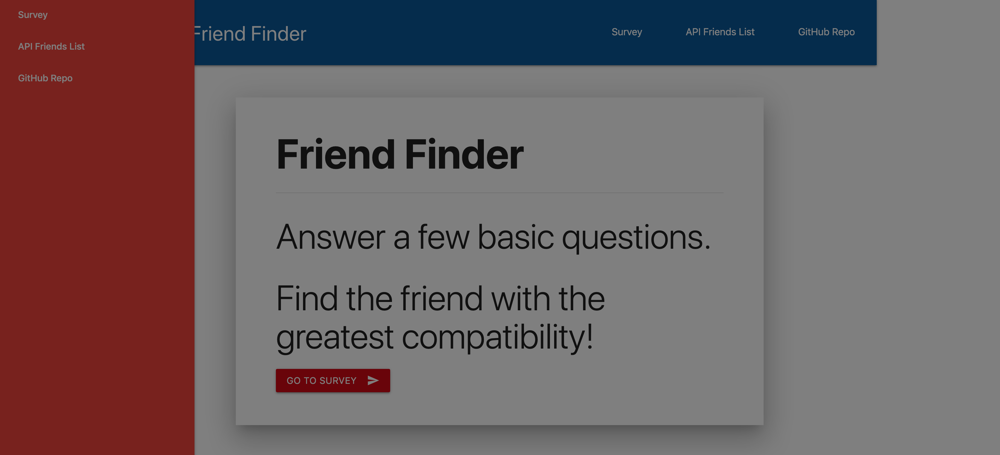

# FriendFinder
Friend Finder App

## Description

**Friend Finder** implements friend matching based on the user's responses to a ten question survey. In my app I simulate athletes user responses to questions with values from 1 (Strongly Disagree) to 5 (Strongly Agree). When the survey is submitted, an existing user record closest to the current user's responses is found and returned. The closest set of user responses is defined as the set with the lowest absolute difference for all ten questions combined.

**Friend Finder** application is meant to simulate a simple survey app. The application is implemented using a [Node.js](https://nodejs.org/en/ target="_blank") and [Express](https://expressjs.com/ target="_blank") server on the back end and the [Materialize](http://materializecss.com/ target="_blank") CSS framework on the front end.

## Demo

	
**Friend Finder** is deployed to Heroku. Please check it out [here]( target="_blank").

## Installation

To install the application follow the instructions below:

	git clone git@github.com:jdb443/FriendFinder.git
	cd FriendFinder
	npm install
	
## Running Locally

To run the application locally and access it in your browser, first set the `PORT` environment variable to the value of your choice. An example is shown below.

	export PORT=3306
	
After the `PORT` environment variable has been set, run the Node.js application with the command below.

	node server.js
	
The application will now be running locally on `PORT`, in this case that is port 3306. You can then access it locally from your browser at the URL `localhost:PORT`, in this case `localhost:3306`.